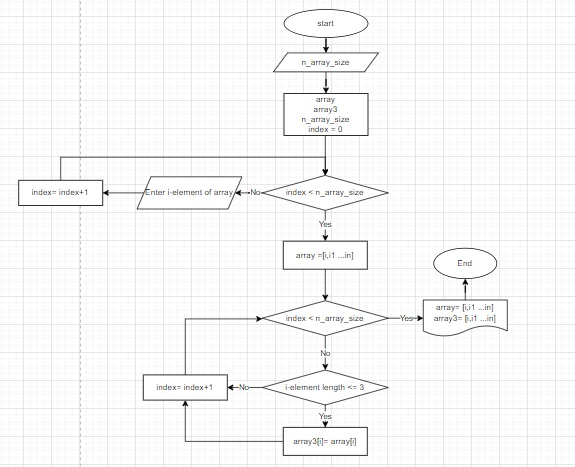

Задача: Написать программу, которая из имеющегося массива строк формирует новый массив из строк, 
длина которых меньше, либо равна 3 символам. Первоначальный массив можно ввести с 
клавиатуры, либо задать на старте выполнения алгоритма. При решении 
не рекомендуется пользоваться коллекциями, лучше обойтись исключительно массивами.

Примеры:
[“Hello”, “2”, “world”, “:-)”] → [“2”, “:-)”]
[“1234”, “1567”, “-2”, “computer science”] → [“-2”]
[“Russia”, “Denmark”, “Kazan”] → []

Below, please, see the description of solving:

1. I created the ability to enter size of array for the user. See Console.Write("Enter size of array: ");
2. I added method for a user to add array elements from the keyboard. And I used cycle "for" to solve it. See Method string[] Enter(int size).
3. I added method "Check3" to check the length of elements in array. If it is equal or less then 3, than it is saved to new array with name "array3". 
To check all of the elements I used again cycle "for".
4. At the end we saw all of the Arrays the initial and Final, see "array" an "array3".  

Block-scheme of my program:

Русский вариант:

1. Я сделал возможность ввода размера массива для пользователя. См. Console.Write("Enter size of array: ");
2. Я добавил метод добавления пользователем элементов массива с клавиатуры. И я использовал цикл «для», чтобы решить это. См. Метод string[] Enter(int size).
3. Я добавил метод "Check3" для проверки длины элементов в массиве. Если он равен или меньше 3, то он сохраняется в новый массив с именем "array3".
Для проверки всех элементов я снова использовал цикл «for».
4. В конце мы увидели все Массивы начальный и Конечный.

Блок-схема моей программы:
(смю.картинку выше)